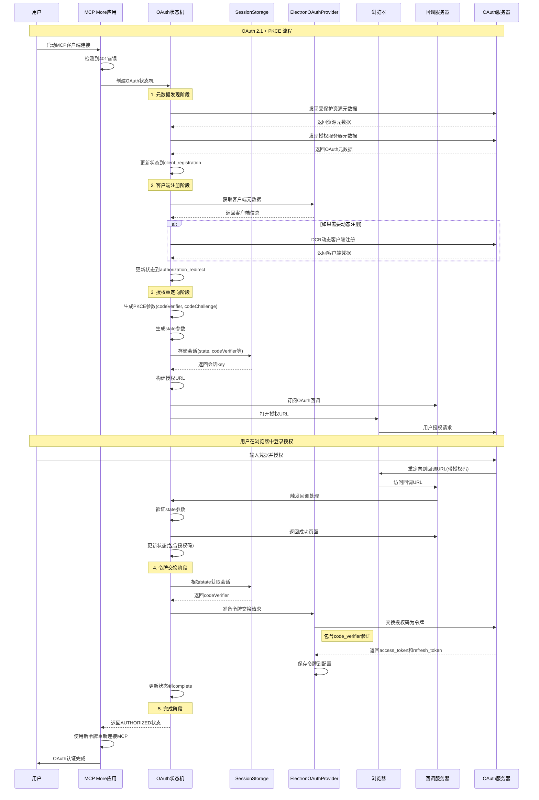

# MCP More OAuth 2.1 + PKCE 流程时序图

## 概述

本文档描述了 MCP More 项目中 OAuth 2.1 + PKCE 认证流程的完整时序图和实现细节。

## 时序图



## 关键流程说明

### 1. 触发条件
- MCP客户端连接失败(401错误)
- 自动触发OAuth状态机

### 2. 状态转换
```
metadata_discovery → client_registration → authorization_redirect → 
authorization_code → token_request → complete
```

### 3. PKCE安全机制
- **`codeVerifier`**: 存储在SessionStorage(内存)
- **`codeChallenge`**: 发送给授权服务器
- 令牌交换时验证`codeVerifier`

### 4. 会话管理
- 临时存储在内存中的SessionStorage
- 按服务器URL隔离
- 10分钟自动过期

### 5. 令牌存储
- 最终令牌保存到应用配置中
- 用于后续MCP客户端连接的Authorization头部

## 核心组件

### OAuth状态机 (OAuthStateMachine)
- **位置**: `src/mcp/services/oauth/oauth-state-machine.ts`
- **职责**: 管理整个OAuth流程的状态转换
- **状态**: metadata_discovery, client_registration, authorization_redirect, authorization_code, token_request, complete

### 会话存储 (SessionStorage)
- **位置**: `src/mcp/services/oauth/sessionStorage.ts`
- **职责**: 临时存储PKCE参数和OAuth会话信息
- **特点**: 内存存储，按服务器隔离，自动过期清理

### OAuth客户端提供者 (ElectronOAuthClientProvider)
- **位置**: `src/mcp/services/oauth/ElectronOAuthClientProvider.ts`
- **职责**: 处理客户端注册、令牌交换等OAuth操作
- **功能**: 支持静态客户端和动态客户端注册(DCR)

### MCP客户端管理器 (McpClientManager)
- **位置**: `src/mcp/services/mcpClientManager.ts`
- **职责**: 管理MCP客户端连接，处理401错误并触发OAuth流程
- **集成**: 将OAuth令牌集成到HTTP请求头中

## PKCE 参数详解

### CodeVerifier (代码验证器)
- **生成**: 随机生成的43-128字符的字符串
- **存储**: 客户端本地安全存储，不发送给授权服务器
- **作用**: 在令牌交换时证明客户端身份

### CodeChallenge (代码质询)
- **生成**: 对 `codeVerifier` 进行 SHA256 哈希 + Base64URL 编码
- **发送**: 在授权请求时发送给授权服务器
- **作用**: 让授权服务器验证后续的 `codeVerifier`

### 安全保证
- **防止授权码拦截**: 即使攻击者获得授权码，没有 `codeVerifier` 也无法获取令牌
- **无需客户端密钥**: 适用于无法安全存储密钥的公共客户端（如桌面应用）
- **动态验证**: 每次认证都使用不同的 PKCE 参数

## 设计特点

### 1. 完全自动化
- 用户只需要在浏览器中完成一次授权
- 状态机自动处理所有OAuth步骤
- 错误处理和重试机制

### 2. 安全性
- 使用OAuth 2.1标准和PKCE扩展
- 临时会话数据只存储在内存中
- State参数验证防止CSRF攻击

### 3. 多服务器支持
- 会话按服务器URL隔离
- 支持同时连接多个OAuth保护的MCP服务器
- 独立的令牌管理

### 4. 用户体验
- 自动打开浏览器进行授权
- 友好的授权完成页面
- 自动关闭浏览器窗口

这个设计实现了现代化、安全、用户友好的OAuth认证流程，符合OAuth 2.1最佳实践。