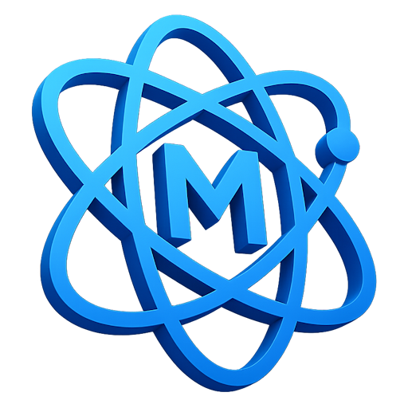
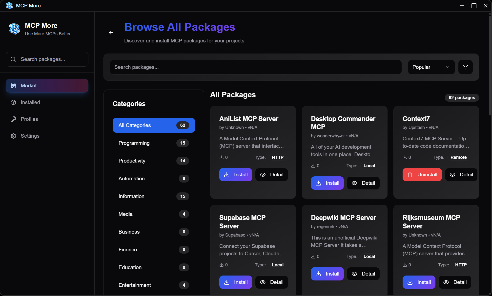

# MCP More



A modern desktop application for managing **Model Context Protocol (MCP)** servers.

[English](./README.md) | [简体中文 (Chinese)](./README.zh-CN.md)


## 📸 Screenshots



## ✨ Features

* 🔍 **MCP Market Browsing**: Discover and install MCP packages from the built-in marketplace
* 📦 **Package Management**: Easily install, enable/disable, and configure MCP packages
* 🔧 **Multiple Connection Types**: Support WebSocket, HTTP/SSE, and local process connections
* 🌗 **Theme Support**: Light/Dark/System theme auto-switching
* 🌍 **Internationalization**: Multi-language interface support

## 📋 System Requirements

* **OS**: Windows 10/11, macOS 10.15+, Linux (Ubuntu 18.04+)
* **Node.js**: 16.x or higher
* **NPM**: 7.x or higher

## 🚀 Getting Started

### Development Setup

1. **Clone the repository**

   ```bash
   git clone https://github.com/toosean/mcp-more.git
   cd mcp-more
   ```

2. **Install dependencies**

   ```bash
   npm install
   ```

3. **Start development server**

   ```bash
   npm run start
   ```

### Build & Packaging

```bash
# Lint the code
npm run lint

# Package the application
npm run package

# Create installer
npm run make

# Publish to GitHub
npm run publish
```

## 🏗️ Project Structure

### Core Components

* **Main Process (`src/main.ts`)**: Electron application lifecycle management
* **Renderer Process (`src/renderer/`)**: React user interface
* **Preload Script (`src/preload.ts`)**: Secure IPC communication bridge

### MCP Management System

```
src/mcp/
├── services/
│   ├── mcpClientManager.ts    # MCP client management
│   ├── toolRegistry.ts        # Tool registry
│   └── sessionManager.ts      # Session management
├── interfaces/                # Type definitions
└── utils/                     # Utility functions
```

### UI Component Structure

```
src/renderer/
├── components/
│   ├── layout/                # Layout components
│   ├── mcp/                   # MCP-related components
│   └── ui/                    # Base UI components
├── pages/                     # Page components
├── hooks/                     # Custom hooks
└── services/                  # Frontend services
```

## 🔧 Configuration

### MCP Package Configuration

MCP packages support three connection types:

#### 1. WebSocket Connection

```json
{
  "identifier": "my-websocket-mcp",
  "name": "My WebSocket MCP",
  "enabled": true,
  "config": {
    "url": "ws://localhost:8080"
  }
}
```

#### 2. HTTP/SSE Connection

```json
{
  "identifier": "my-http-mcp",
  "name": "My HTTP MCP",
  "enabled": true,
  "config": {
    "url": "https://api.example.com/mcp"
  }
}
```

#### 3. Local Process

```json
{
  "identifier": "my-local-mcp",
  "name": "My Local MCP",
  "enabled": true,
  "config": {
    "command": "python /path/to/mcp-server.py",
    "environment": {
      "API_KEY": "your-api-key"
    }
  }
}
```

### Application Settings

Configuration is stored in platform-specific locations:

* **Windows**: `%APPDATA%/mcp-more/config.json`
* **macOS**: `~/Library/Preferences/mcp-more/config.json`
* **Linux**: `~/.config/mcp-more/config.json`

## 📚 User Guide

### 1. Browse MCP Market

* Open the app; the default page is the marketplace
* Browse available MCP packages
* View package details, description, and tools

### 2. Install MCP Packages

* Click "Install" in the marketplace
* Or manually add MCP packages in the "Browse" page
* Configure connection parameters (URL or command)

### 3. Manage Installed Packages

* View all installed packages in the "Installed" page
* Enable/disable packages
* Monitor tool usage statistics

### 4. Configure Application Settings

* Adjust theme, language, etc., in the "Settings" page
* Configure startup and system tray options
* Manage telemetry and statistics

## 🛠️ Developer Guide

### Tech Stack

* **Framework**: Electron + React
* **Language**: TypeScript
* **Build Tool**: Vite + Electron Forge
* **UI Library**: Radix UI + Tailwind CSS
* **Internationalization**: i18next
* **Logging**: electron-log

### Coding Standards

* Use ESLint for code checks
* Follow TypeScript strict mode
* Functional programming style for components
* IPC communication uses `invoke/handle` pattern

### Debugging

* Main process logs: output via `electron-log` to console and file
* Renderer process: use Chrome DevTools
* Configuration file location can be checked in the app's "Settings"

## 🤝 Contributing

Contributions are welcome!

1. Fork the repository
2. Create a feature branch (`git checkout -b feature/amazing-feature`)
3. Commit your changes (`git commit -m 'Add some amazing feature'`)
4. Push to the branch (`git push origin feature/amazing-feature`)
5. Create a Pull Request

## 📄 License

This project is licensed under **AGPLv3** - see [LICENSE](LICENSE) for details.

## 🙏 Acknowledgements

* [Model Context Protocol](https://modelcontextprotocol.io/) - Core protocol support
* [Electron](https://electronjs.org/) - Cross-platform desktop framework
* [React](https://reactjs.org/) - UI library
* [Radix UI](https://radix-ui.com/) - Accessible UI components

## 📞 Support

* 🐛 [Report Issues](https://github.com/toosean/mcp-more/issues)
* 💬 [Discussions & Suggestions](https://github.com/toosean/mcp-more/discussions)
* 📧 Contact author: [toosean@gmail.com](mailto:toosean@gmail.com)

---

<div align="center">
Made with ❤️ by <a href="https://github.com/toosean">toosean</a>
</div>  